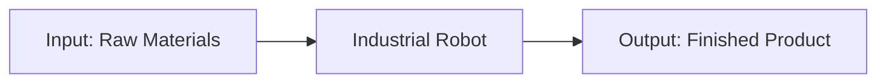

# Chapter 1: What is Robotics?

## Introduction

Robotics is a multidisciplinary field that combines engineering, computer science, and artificial intelligence to design, construct, and operate robots. In this chapter, we'll explore what robotics means, its historical evolution, and its impact on our world.

## What is a Robot?

### Definition

A **robot** is a programmable machine capable of carrying out a complex series of actions automatically. Robots can be guided by an external control device or the control may be embedded within.

### Key Characteristics

Robots typically possess these essential characteristics:

1. **Programmability**: Can be instructed to perform tasks
2. **Sensing**: Can perceive their environment
3. **Actuation**: Can physically interact with the world
4. **Intelligence**: Can make decisions based on input

```python
# Simplified robot pseudo-code
class Robot:
    def __init__(self):
        self.sensors = []
        self.actuators = []
        self.program = None

    def sense(self):
        """Collect information from environment"""
        pass

    def think(self, sensor_data):
        """Process information and make decisions"""
        pass

    def act(self, decision):
        """Execute physical actions"""
        pass
```

## A Brief History of Robotics

### Ancient Automata (3000 BCE - 1500 CE)

- **3000 BCE**: Egyptian water clocks with moving figures
- **400 BCE**: Archytas's mechanical pigeon (considered first robot)
- **1206 CE**: Al-Jazari's automated devices

### Early Modern Period (1500 - 1950)

- **1738**: Jacques de Vaucanson's mechanical duck
- **1898**: Nikola Tesla demonstrates remote-controlled vessel
- **1921**: Term "robot" coined by Karel Čapek

### Computer Age (1950 - 2000)

- **1954**: First programmable robot (Unimate)
- **1969**: Shakey, the first mobile robot
- **1974**: First industrial robot with vision system

### Modern Era (2000 - Present)

- **2000**: ASIMO robot by Honda
- **2005**: Boston Dynamics' BigDog
- **2011**: Watson wins Jeopardy
- **2020**: GPT-3 demonstrates advanced AI capabilities

## Types of Robots

### 1. Industrial Robots
- **Purpose**: Manufacturing and production
- **Examples**: Robotic arms, assembly line robots
- **Characteristics**: High precision, repetitive tasks



### 2. Service Robots
- **Purpose**: Assist humans in various tasks
- **Examples**: Domestic cleaners, surgical assistants
- **Characteristics**: Human-robot interaction, safety features

### 3. Medical Robots
- **Purpose**: Healthcare applications
- **Examples**: Surgical robots, rehabilitation devices
- **Characteristics**: High precision, sterile operation

### 4. Educational Robots
- **Purpose**: Teaching and learning
- **Examples**: Lego Mindstorms, NAO robot
- **Characteristics**: User-friendly, programmable

### 5. Military and Defense Robots
- **Purpose**: Defense and security
- **Examples**: Drones, bomb disposal robots
- **Characteristics**: Rugged design, autonomous capabilities

## Current Applications

### Manufacturing
- **Assembly**: Automotive, electronics
- **Quality Control**: Inspection and testing
- **Packaging**: Sorting and shipping

### Healthcare
- **Surgery**: Precise minimally invasive procedures
- **Rehabilitation**: Assist in patient recovery
- **Diagnosis**: Analyze medical data

### Agriculture
- **Harvesting**: Automated crop collection
- **Monitoring**: Crop health assessment
- **Spraying**: Precision pesticide application

### Exploration
- **Space**: Mars rovers, space station assistants
- **Ocean**: Underwater exploration
- **Disaster**: Search and rescue operations

### Entertainment
- **Movies**: Animatronics and CGI
- **Gaming**: Interactive experiences
- **Sports**: Robotic competitions

## Future Trends

### 1. Increased Autonomy
- Advanced AI decision-making
- Improved learning capabilities
- Better environmental adaptation

### 2. Human-Robot Collaboration
- Cobots working alongside humans
- Enhanced safety features
- Natural interaction methods

### 3. Miniaturization
- Nanorobots for medical applications
- Swarm robotics
- Micro-manipulation

### 4. Soft Robotics
- Flexible materials
- Bio-inspired designs
- Safe human interaction

## The Robotics Field

### Disciplines Involved

Robotics combines multiple fields:

1. **Mechanical Engineering**
   - Robot design and construction
   - Actuator systems
   - Material selection

2. **Electrical Engineering**
   - Sensor systems
   - Power electronics
   - Control circuits

3. **Computer Science**
   - Programming and algorithms
   - Artificial intelligence
   - Computer vision

4. **Mathematics**
   - Kinematics and dynamics
   - Control theory
   - Statistical analysis

### Career Opportunities

The robotics field offers diverse roles:
- **Robotics Engineer**: Design and build robots
- **AI Specialist**: Develop intelligent behaviors
- **Controls Engineer**: Implement control systems
- **Research Scientist**: Advance the field
- **Applications Engineer**: Customize solutions

## Ethical Considerations

### Job Displacement
- Automation replacing human workers
- Need for workforce retraining
- Economic impacts

### Safety and Security
- Ensuring safe human-robot interaction
- Preventing malicious use
- Liability and responsibility

### Privacy Concerns
- Data collection by robots
- Surveillance capabilities
- Information security

## Summary

In this chapter, we've learned:

- Robotics is a multidisciplinary field creating programmable machines
- Robots have evolved from ancient automata to modern AI systems
- Various types of robots serve different purposes
- Applications span manufacturing to healthcare to exploration
- Future trends include increased autonomy and human collaboration

## Key Terms

- **Robot**: Programmable machine capable of autonomous action
- **Actuator**: Device that enables movement
- **Sensor**: Device that perceives environment
- **Autonomy**: Ability to operate without human intervention
- **Cobot**: Collaborative robot designed to work with humans

## Discussion Questions

1. What differentiates a robot from a simple machine?
2. How have historical developments influenced modern robotics?
3. Which type of robot do you think will have the most impact in the next decade?
4. What ethical considerations should guide robotics development?

---

## Next Steps

Ready to continue your journey? Move on to [Chapter 2: Robot Components](2-robot-components.md) to understand how robots are built.

*Use the chat assistant to ask questions about any concept in this chapter!*