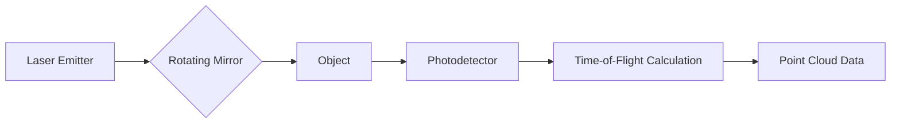
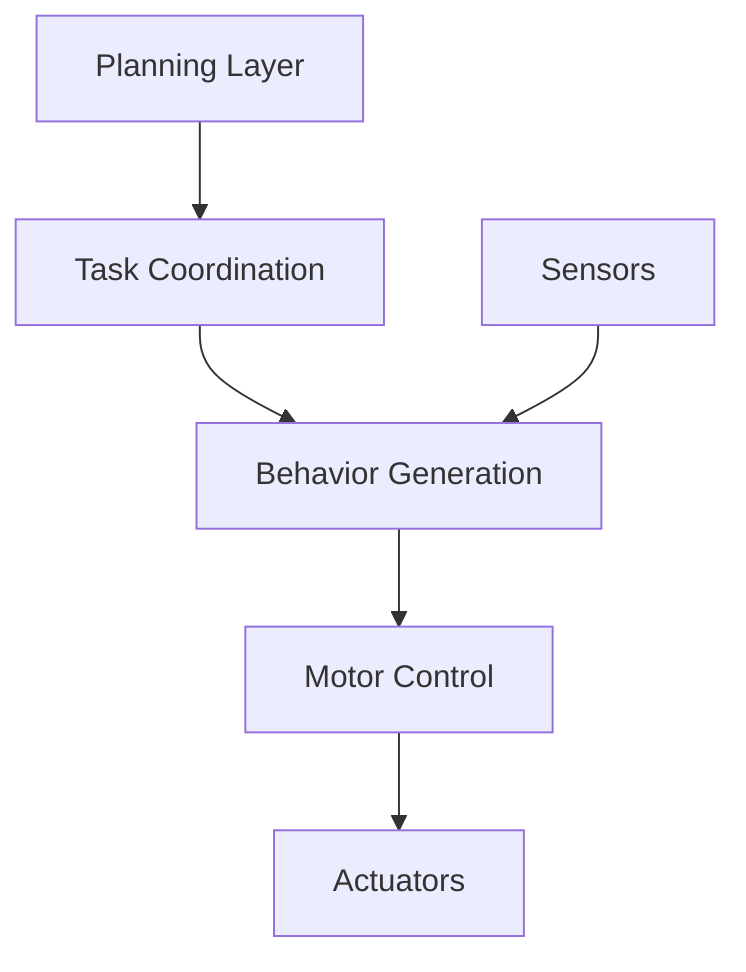

# Chapter 2: Robot Components

## Introduction

Robots are complex systems composed of multiple interconnected components. In this chapter, we'll explore the fundamental building blocks that make robots work: sensors for perception, actuators for movement, control systems for intelligence, and power systems for energy.

## Sensors: The Robot's Senses

### What are Sensors?

Sensors are devices that detect and respond to physical stimuli, converting them into signals that can be processed by a robot's control system.

### Types of Sensors

#### 1. Proprioceptive Sensors (Internal)

These sensors provide information about the robot's internal state:

- **Encoders**: Measure joint angles and rotation
- **Inertial Measurement Units (IMUs)**: Track orientation and acceleration
- **Force/Torque Sensors**: Detect applied forces and torques
- **Current Sensors**: Monitor power consumption

```python
class IMUSensor:
    def __init__(self):
        self.acceleration = [0, 0, 0]
        self.gyroscope = [0, 0, 0]
        self.magnetometer = [0, 0, 0]

    def read_orientation(self):
        """Calculate orientation from sensor data"""
        # Complementary filter implementation
        pitch = self.calculate_pitch()
        roll = self.calculate_roll()
        yaw = self.calculate_yaw()
        return pitch, roll, yaw

    def calibrate(self):
        """Calibrate sensor biases"""
        pass
```

#### 2. Exteroceptive Sensors (External)

These sensors provide information about the environment:

- **Vision Sensors**: Cameras (RGB, depth, thermal)
- **Range Sensors**: Lidar, sonar, infrared
- **Tactile Sensors**: Touch, pressure, vibration
- **Chemical Sensors**: Gas, liquid, biological

### Vision Systems

#### Camera Types
- **Monocular**: Single camera, provides 2D images
- **Stereo**: Paired cameras for depth perception
- **RGB-D**: Color plus depth information
- **360°**: Panoramic view using multiple cameras

```python
import cv2
import numpy as np

class VisionProcessor:
    def __init__(self, camera_id=0):
        self.camera = cv2.VideoCapture(camera_id)

    def detect_objects(self, frame):
        """Detect objects using YOLO algorithm"""
        # Object detection implementation
        bounding_boxes = []
        confidence_scores = []
        class_ids = []

        # Process frame with neural network
        # ... detection logic ...

        return bounding_boxes, confidence_scores, class_ids

    def track_motion(self, frame1, frame2):
        """Track motion between frames using optical flow"""
        # Optical flow calculation
        flow = cv2.calcOpticalFlowPyrLK(frame1, frame2, ...)
        return flow
```

### Range Sensing

#### Lidar (Light Detection and Ranging)

**Working Principle**: Emits laser pulses and measures time-of-flight

- **2D Lidar**: Scans in a single plane
- **3D Lidar**: Multi-plane scanning for volumetric data
- **Solid State**: No moving parts, more reliable

**Applications**:
- Autonomous vehicle navigation
- Mapping and localization
- Object detection and avoidance



## Actuators: Making Robots Move

### What are Actuators?

Actuators convert electrical, hydraulic, or pneumatic energy into mechanical motion. They are the "muscles" of a robot.

### Types of Actuators

#### 1. Electric Actuators

**DC Motors**
- Simple, inexpensive
- Good for wheeled robots
- Variable speed control

```python
class DCMotor:
    def __init__(self, pins):
        self.pin_pwm = pins['pwm']
        self.pin_dir1 = pins['dir1']
        self.pin_dir2 = pins['dir2']
        self.speed = 0

    def set_speed(self, speed):
        """Set motor speed (-100 to 100)"""
        self.speed = max(-100, min(100, speed))

        # Set direction pins
        if speed > 0:
            self.pin_dir1.on()
            self.pin_dir2.off()
        elif speed < 0:
            self.pin_dir1.off()
            self.pin_dir2.on()
        else:
            self.pin_dir1.off()
            self.pin_dir2.off()

        # Set PWM
        duty_cycle = abs(speed) / 100.0
        self.pin_pwm.duty_cycle(duty_cycle)
```

**Servo Motors**
- Precise position control
- Built-in feedback
- Common in robotic arms

**Stepper Motors**
- Precise step control
- Open-loop operation
- High holding torque

#### 2. Hydraulic Actuators

**Characteristics**:
- Extremely high force
- Smooth motion
- Complex maintenance
- Often used in heavy-duty applications

**Applications**:
- Excavators
- Construction robots
- Industrial manipulators

#### 3. Pneumatic Actuators

**Characteristics**:
- Fast response
- Clean operation
- Limited precision
- Requires compressed air system

**Applications**:
- Grippers
- Soft robotics
- Material handling

#### 4. Shape Memory Alloys

**Working Principle**: Metals that return to original shape when heated

**Advantages**:
- Silent operation
- High power-to-weight ratio
- Simple design

**Disadvantages**:
- Limited speed
- Energy inefficient
- Complex control

## Control Systems: The Robot's Brain

### Control Architecture

#### 1. Reactive Control

Responds immediately to sensor input without planning:

```python
class ReactiveController:
    def __init__(self):
        self.behaviors = []

    def add_behavior(self, behavior, priority):
        self.behaviors.append((behavior, priority))
        self.behaviors.sort(key=lambda x: x[1], reverse=True)

    def execute(self, sensor_data):
        for behavior, _ in self.behaviors:
            action = behavior(sensor_data)
            if action is not None:
                return action
        return None

    def avoid_obstacles(self, sensor_data):
        if sensor_data.min_distance < 0.5:
            return "turn_left"
        return None

    def seek_goal(self, sensor_data):
        if sensor_data.goal_visible:
            return "move_forward"
        return None
```

#### 2. Hierarchical Control

Multiple layers of control with different time scales:

- **High-level**: Planning and decision making
- **Mid-level**: Task coordination
- **Low-level**: Motor control



#### 3. Distributed Control

Decentralized control architecture:

- Multiple controllers working together
- Each controls a subset of functionality
- Communication protocols for coordination

### PID Control

**Proportional-Integral-Derivative Control** is the most common control algorithm:

```python
class PIDController:
    def __init__(self, kp, ki, kd, setpoint):
        self.kp = kp  # Proportional gain
        self.ki = ki  # Integral gain
        self.kd = kd  # Derivative gain
        self.setpoint = setpoint

        self.integral = 0
        self.last_error = 0

    def update(self, current_value, dt):
        error = self.setpoint - current_value

        # Proportional term
        P = self.kp * error

        # Integral term
        self.integral += error * dt
        self.integral = max(-1, min(1, self.integral))  # Anti-windup
        I = self.ki * self.integral

        # Derivative term
        derivative = (error - self.last_error) / dt if dt > 0 else 0
        D = self.kd * derivative

        self.last_error = error

        return P + I + D
```

### Motion Planning

#### Configuration Space

The space of all possible robot configurations:

- **Configuration (q)**: Vector of all joint positions
- **Degrees of Freedom (DoF)**: Number of independent variables
- **Constraints**: Limits on joint angles, self-collision, obstacles

#### Sampling-Based Planners

**RRT (Rapidly-exploring Random Trees)**:

```python
import random
import numpy as np

class RRTPlanner:
    def __init__(self, start, goal, obstacles, max_iter=10000):
        self.start = start
        self.goal = goal
        self.obstacles = obstacles
        self.max_iter = max_iter
        self.tree = [start]
        self.parent = {0: None}

    def plan(self):
        for i in range(self.max_iter):
            # Sample random configuration
            if random.random() < 0.1:  # 10% chance to sample goal
                q_rand = self.goal
            else:
                q_rand = self.sample_random()

            # Find nearest node in tree
            q_near_idx = self.find_nearest(q_rand)
            q_near = self.tree[q_near_idx]

            # Steer towards random configuration
            q_new = self.steer(q_near, q_rand)

            # Check if path is collision-free
            if self.is_collision_free(q_near, q_new):
                q_new_idx = len(self.tree)
                self.tree.append(q_new)
                self.parent[q_new_idx] = q_near_idx

                # Check if goal reached
                if self.distance(q_new, self.goal) < 0.1:
                    return self.reconstruct_path(q_new_idx)

        return None

    def distance(self, q1, q2):
        """Calculate distance between configurations"""
        return np.linalg.norm(np.array(q1) - np.array(q2))
```

## Power Systems: Energy Management

### Battery Technologies

#### 1. Lithium-Ion Batteries

**Advantages**:
- High energy density
- Low self-discharge
- No memory effect

**Disadvantages**:
- Sensitive to overcharging
- Temperature dependent
- Safety concerns

```python
class BatteryManager:
    def __init__(self, voltage, capacity, chemistry="Li-ion"):
        self.voltage = voltage  # Nominal voltage
        self.capacity = capacity  # Amp-hours
        self.chemistry = chemistry
        self.current_charge = capacity
        self.temperature = 25.0  # Celsius

    def get_state_of_charge(self):
        """Calculate battery percentage"""
        return (self.current_charge / self.capacity) * 100

    def discharge(self, current, time):
        """Calculate discharge for given current and time"""
        # Peukert's law for non-linear discharge
        peukert_exp = 1.2  # Typical for Li-ion
        discharged_capacity = current * (time ** peukert_exp)

        self.current_charge -= discharged_capacity
        self.current_charge = max(0, self.current_charge)

        # Update temperature (simplified model)
        self.temperature += 0.01 * current
        return self.current_charge
```

#### 2. Lead-Acid Batteries

**Advantages**:
- Inexpensive
- Robust
- Recyclable

**Disadvantages**:
- Heavy
- Low energy density
- Voltage sag under load

#### 3. Fuel Cells

**Working Principle**: Convert chemical energy directly to electrical energy

- **Hydrogen Fuel Cells**: Clean, high efficiency
- **Methanol Fuel Cells**: Easier fuel storage
- **Solid Oxide**: High temperature, high efficiency

### Power Electronics

#### Motor Drivers

**H-Bridge Circuit**:
```
    +V
     |
    [M1]---[M3]
     |     |
    Motor  |
     |     |
    [M2]---[M4]
     |
    GND
```

```python
class HBridgeDriver:
    def __init__(self, pins):
        self.pin_1 = pins['m1']
        self.pin_2 = pins['m2']
        self.pin_3 = pins['m3']
        self.pin_4 = pins['m4']
        self.pin_pwm = pins['pwm']

    def set_motor(self, speed, brake=False):
        if brake:
            # Active braking
            self.pin_1.on()
            self.pin_2.on()
            self.pin_3.on()
            self.pin_4.on()
            self.pin_pwm.on()
        elif speed > 0:
            # Forward
            self.pin_1.on()
            self.pin_2.off()
            self.pin_3.on()
            self.pin_4.off()
            self.pin_pwm.duty_cycle(speed / 100.0)
        elif speed < 0:
            # Reverse
            self.pin_1.off()
            self.pin_2.on()
            self.pin_3.off()
            self.pin_4.on()
            self.pin_pwm.duty_cycle(abs(speed) / 100.0)
        else:
            # Coast
            self.pin_1.off()
            self.pin_2.off()
            self.pin_3.off()
            self.pin_4.off()
            self.pin_pwm.off()
```

#### Power Management

- **Voltage Regulation**: Maintain stable voltage
- **Current Limiting**: Protect components
- **Power Monitoring**: Track consumption
- **Energy Recovery**: Regenerative braking

## Integration Examples

### Mobile Robot Platform

```python
class MobileRobot:
    def __init__(self):
        # Sensors
        self.lidar = LidarSensor()
        self.imu = IMUSensor()
        self.battery = BatteryManager(12.0, 20.0)

        # Actuators
        self.left_motor = DCMotor({'pwm': pin1, 'dir1': pin2, 'dir2': pin3})
        self.right_motor = DCMotor({'pwm': pin4, 'dir1': pin5, 'dir2': pin6})

        # Controllers
        self.motion_planner = RRTPlanner()
        self.pid_left = PIDController(kp=1.0, ki=0.1, kd=0.05, setpoint=0)
        self.pid_right = PIDController(kp=1.0, ki=0.1, kd=0.05, setpoint=0)

    def navigate_to(self, goal_position):
        """Navigate to a target position"""
        # Get current sensor readings
        scan_data = self.lidar.scan()
        orientation = self.imu.read_orientation()
        battery_level = self.battery.get_state_of_charge()

        # Check battery level
        if battery_level < 20:
            print("Warning: Low battery!")
            return False

        # Plan path
        current_pos = self.get_position()
        path = self.motion_planner.plan(current_pos, goal_position, scan_data)

        # Execute path
        for waypoint in path:
            if not self.move_to_waypoint(waypoint):
                return False

        return True

    def move_to_waypoint(self, waypoint):
        """Move to a specific waypoint"""
        current_pos = self.get_position()
        error = waypoint - current_pos

        # Simple proportional control
        speed = 50.0
        turn_rate = error * 10.0

        # Set motor speeds
        self.left_motor.set_speed(speed - turn_rate)
        self.right_motor.set_speed(speed + turn_rate)

        return True
```

## Design Considerations

### Component Selection

1. **Performance Requirements**
   - Speed and precision
   - Payload capacity
   - Operating environment

2. **Energy Efficiency**
   - Battery life
   - Power consumption
   - Energy recovery

3. **Cost Constraints**
   - Component costs
   - Maintenance
   - Scalability

4. **Reliability**
   - MTBF (Mean Time Between Failures)
   - Redundancy
   - Fail-safe mechanisms

### System Integration

1. **Mechanical Design**
   - Structural rigidity
   - Weight distribution
   - Vibration damping

2. **Electrical Design**
   - Wire routing
   - EMI shielding
   - Grounding

3. **Software Architecture**
   - Real-time constraints
   - Communication protocols
   - Error handling

## Testing and Validation

### Sensor Calibration

```python
def calibrate_lidar(lidar, known_distance):
    """Calibrate lidar using known reference distance"""
    measurements = []

    for _ in range(100):
        distance = lidar.measure_distance()
        measurements.append(distance)

    avg_measurement = sum(measurements) / len(measurements)
    correction_factor = known_distance / avg_measurement

    return correction_factor
```

### Actuator Testing

- **Position Accuracy**: Compare commanded vs actual position
- **Torque Testing**: Measure output force/torque
- **Speed Testing**: Verify maximum speeds
- **Durability**: Cycle testing

### System Validation

1. **Unit Testing**: Test individual components
2. **Integration Testing**: Test component interactions
3. **System Testing**: Test complete functionality
4. **Field Testing**: Test in real environments

## Summary

In this chapter, we've covered:

- **Sensors**: How robots perceive their environment
- **Actuators**: How robots create physical motion
- **Control Systems**: How robots make decisions and execute actions
- **Power Systems**: How robots are powered and managed energy
- **Integration**: How components work together as a complete system

Understanding these components is essential for designing and building effective robotic systems.

## Key Terms

- **Sensor**: Device that detects physical stimuli
- **Actuator**: Converts energy into mechanical motion
- **PID Controller**: Control algorithm with proportional, integral, derivative terms
- **Configuration Space**: All possible robot configurations
- **Power Density**: Power output per unit mass

## Discussion Questions

1. How do you choose the right sensor for a specific application?
2. When would you use hydraulic vs electric actuators?
3. What are the trade-offs between different control architectures?
4. How do battery technologies impact robot design?

---

## Next Steps

Ready to continue? Move on to [Chapter 3: AI Fundamentals](3-ai-fundamentals.md) to understand how artificial intelligence enables intelligent robot behavior.

*Use the chat assistant to ask questions about any concept in this chapter!*