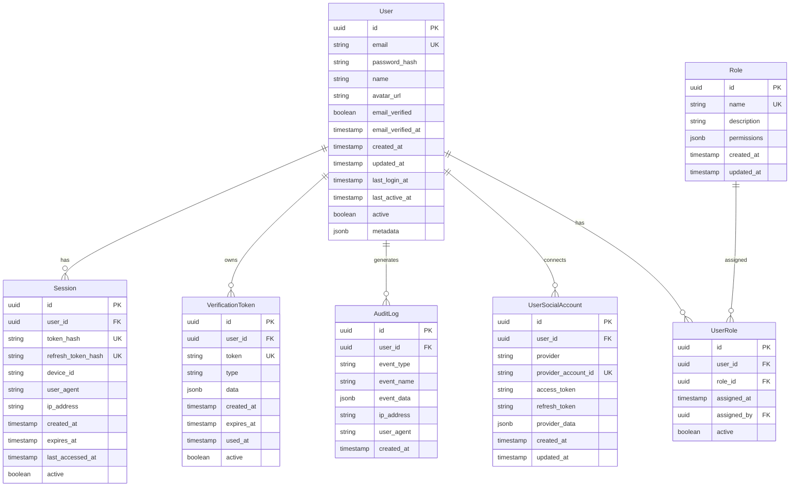

# Authentication Data Model

**Feature**: BetterAuth Authentication System
**Database**: Neon PostgreSQL
**Version**: 1.0.0
**Last Updated**: 2025-01-15

## Entity Relationship Overview



## Core Entities

### 1. User
The central entity representing a registered user in the system.

**Fields:**
- `id` (UUID): Primary key, auto-generated
- `email` (String, Unique): User's email address
- `password_hash` (String): Bcrypt/argon2 hashed password
- `name` (String, Optional): Display name
- `avatar_url` (String, Optional): Profile picture URL
- `email_verified` (Boolean): Email verification status
- `email_verified_at` (Timestamp, Optional): When email was verified
- `created_at` (Timestamp): Account creation time
- `updated_at` (Timestamp): Last profile update
- `last_login_at` (Timestamp, Optional): Last successful login
- `last_active_at` (Timestamp, Optional): Last activity time
- `active` (Boolean): Account status (active/inactive)
- `metadata` (JSON): Additional user data

**Constraints:**
- Email must be unique and valid format
- Password hash minimum 60 characters
- Name maximum 255 characters

### 2. Session
Manages active user sessions for authentication tracking.

**Fields:**
- `id` (UUID): Primary key
- `user_id` (UUID, Foreign Key): Reference to User
- `token_hash` (String, Unique): Hashed access token
- `refresh_token_hash` (String, Unique, Optional): Hashed refresh token
- `device_id` (String, Optional): Device fingerprint
- `user_agent` (String, Optional): Browser/client info
- `ip_address` (String, Optional): Client IP address
- `created_at` (Timestamp): Session start time
- `expires_at` (Timestamp): Session expiration
- `last_accessed_at` (Timestamp): Last activity
- `active` (Boolean): Session status

**Features:**
- Supports "Remember Me" with refresh tokens
- Tracks multiple concurrent sessions
- Automatic cleanup of expired sessions
- Device and location tracking

### 3. VerificationToken
Handles one-time tokens for email verification and password resets.

**Fields:**
- `id` (UUID): Primary key
- `user_id` (UUID, Foreign Key): Reference to User
- `token` (String, Unique): The verification token
- `type` (Enum): Token type (EMAIL_VERIFICATION, PASSWORD_RESET, etc.)
- `data` (JSON, Optional): Additional token data
- `created_at` (Timestamp): Token generation time
- `expires_at` (Timestamp): Token expiration
- `used_at` (Timestamp, Optional): When token was used
- `active` (Boolean): Token status

**Token Types:**
- `EMAIL_VERIFICATION`: Verify new email addresses
- `PASSWORD_RESET`: Reset forgotten passwords
- `EMAIL_CHANGE`: Verify email address changes
- `ACCOUNT_DELETION`: Confirm account deletion

### 4. Role
Defines user roles with associated permissions.

**Fields:**
- `id` (UUID): Primary key
- `name` (String, Unique): Role name
- `description` (String, Optional): Role description
- `permissions` (JSON): Permission objects
- `created_at` (Timestamp): Role creation
- `updated_at` (Timestamp): Last update

**Default Roles:**
- `user`: Basic chat and profile access
- `moderator`: Content moderation capabilities
- `admin`: Full system administration

**Permission Structure:**
```json
{
  "chat": true,
  "profile": true,
  "moderate": true,
  "admin": true
}
```

### 5. UserRole
Many-to-many relationship between users and roles.

**Fields:**
- `id` (UUID): Primary key
- `user_id` (UUID, Foreign Key): Reference to User
- `role_id` (UUID, Foreign Key): Reference to Role
- `assigned_at` (Timestamp): When role was assigned
- `assigned_by` (UUID, Foreign Key, Optional): Who assigned it
- `active` (Boolean): Assignment status

### 6. UserSocialAccount (Future Extension)
Optional social login provider connections.

**Fields:**
- `id` (UUID): Primary key
- `user_id` (UUID, Foreign Key): Reference to User
- `provider` (String): Social provider (Google, GitHub, etc.)
- `provider_account_id` (String, Unique): Provider's user ID
- `access_token` (String, Optional): Provider access token
- `refresh_token` (String, Optional): Provider refresh token
- `provider_data` (JSON): Additional provider data
- `created_at` (Timestamp): Connection time
- `updated_at` (Timestamp): Last update

### 7. AuditLog
Security and compliance event tracking.

**Fields:**
- `id` (UUID): Primary key
- `user_id` (UUID, Foreign Key, Optional): Related user
- `event_type` (Enum): Type of security event
- `event_name` (String): Human-readable event name
- `event_data` (JSON): Event-specific data
- `ip_address` (String, Optional): Client IP
- `user_agent` (String, Optional): Browser info
- `created_at` (Timestamp): Event timestamp

**Event Types:**
- `LOGIN_SUCCESS`
- `LOGIN_FAILURE`
- `LOGOUT`
- `REGISTER`
- `EMAIL_VERIFIED`
- `PASSWORD_CHANGED`
- `PASSWORD_RESET_REQUEST`
- `ACCOUNT_DELETED`
- `ROLE_ASSIGNED`
- `ROLE_REMOVED`

## Database Schema

### Table Creation SQL

```sql
-- Enable UUID extension
CREATE EXTENSION IF NOT EXISTS "uuid-ossp";

-- Users table
CREATE TABLE users (
    id UUID PRIMARY KEY DEFAULT gen_random_uuid(),
    email VARCHAR(255) UNIQUE NOT NULL,
    password_hash VARCHAR(255) NOT NULL,
    name VARCHAR(255),
    avatar_url TEXT,
    email_verified BOOLEAN DEFAULT FALSE NOT NULL,
    email_verified_at TIMESTAMPTZ,
    created_at TIMESTAMPTZ DEFAULT NOW() NOT NULL,
    updated_at TIMESTAMPTZ DEFAULT NOW() NOT NULL,
    last_login_at TIMESTAMPTZ,
    last_active_at TIMESTAMPTZ,
    active BOOLEAN DEFAULT TRUE NOT NULL,
    metadata JSONB DEFAULT '{}'::jsonb NOT NULL,

    CONSTRAINT users_email_check CHECK (email ~* '^[A-Za-z0-9._%+-]+@[A-Za-z0-9.-]+\.[A-Za-z]{2,}$'),
    CONSTRAINT users_password_length CHECK (LENGTH(password_hash) >= 60)
);

-- Indexes for users
CREATE INDEX idx_users_email ON users (email);
CREATE INDEX idx_users_active ON users (active);
CREATE INDEX idx_users_created_at ON users (created_at);

-- Sessions table
CREATE TABLE sessions (
    id UUID PRIMARY KEY DEFAULT gen_random_uuid(),
    user_id UUID NOT NULL REFERENCES users(id) ON DELETE CASCADE,
    token_hash VARCHAR(255) UNIQUE NOT NULL,
    refresh_token_hash VARCHAR(255) UNIQUE,
    device_id VARCHAR(255),
    user_agent TEXT,
    ip_address INET,
    created_at TIMESTAMPTZ DEFAULT NOW() NOT NULL,
    expires_at TIMESTAMPTZ NOT NULL,
    last_accessed_at TIMESTAMPTZ DEFAULT NOW() NOT NULL,
    active BOOLEAN DEFAULT TRUE NOT NULL
);

-- Indexes for sessions
CREATE INDEX idx_sessions_user_id ON sessions (user_id);
CREATE INDEX idx_sessions_active ON sessions (active);
CREATE INDEX idx_sessions_expires_at ON sessions (expires_at);

-- Roles table
CREATE TABLE roles (
    id UUID PRIMARY KEY DEFAULT gen_random_uuid(),
    name VARCHAR(100) UNIQUE NOT NULL,
    description TEXT,
    permissions JSONB DEFAULT '{}'::jsonb NOT NULL,
    created_at TIMESTAMPTZ DEFAULT NOW() NOT NULL,
    updated_at TIMESTAMPTZ DEFAULT NOW() NOT NULL
);

-- Insert default roles
INSERT INTO roles (name, description, permissions) VALUES
    ('user', 'Regular user', '{"chat": true, "profile": true}'),
    ('moderator', 'Content moderator', '{"chat": true, "profile": true, "moderate": true}'),
    ('admin', 'System admin', '{"chat": true, "profile": true, "moderate": true, "admin": true}');
```

## Data Access Patterns

### 1. Authentication Flow

```python
# Get user for authentication
SELECT id, email, password_hash, active
FROM users
WHERE email = $1 AND active = TRUE;

# Create new session
INSERT INTO sessions (
    user_id, token_hash, refresh_token_hash,
    device_id, user_agent, ip_address, expires_at
) VALUES ($1, $2, $3, $4, $5, $6, NOW() + INTERVAL '7 days');

# Validate session
SELECT s.*, u.email, u.roles
FROM sessions s
JOIN users u ON s.user_id = u.id
WHERE s.token_hash = $1
    AND s.active = TRUE
    AND s.expires_at > NOW();
```

### 2. Authorization Check

```python
# Get user permissions
SELECT DISTINCT r.name, r.permissions
FROM user_roles ur
JOIN roles r ON ur.role_id = r.id
WHERE ur.user_id = $1 AND ur.active = TRUE;

# Check specific permission
SELECT EXISTS (
    SELECT 1
    FROM user_roles ur
    JOIN roles r ON ur.role_id = r.id
    WHERE ur.user_id = $1
        AND ur.active = TRUE
        AND r.permissions @> $2::jsonb
);
```

### 3. Token Management

```python
# Create verification token
INSERT INTO verification_tokens (
    user_id, token, token_type, expires_at
) VALUES ($1, $2, 'EMAIL_VERIFICATION', NOW() + INTERVAL '24 hours');

# Validate token
SELECT id, user_id, active
FROM verification_tokens
WHERE token = $1
    AND token_type = $2
    AND active = TRUE
    AND expires_at > NOW();
```

## Security Considerations

### 1. Password Security
- Use argon2id with proper parameters:
  - Memory cost: 64MB
  - Time cost: 3 iterations
  - Parallelism: 4 threads
  - Salt length: 16 bytes
  - Hash length: 32 bytes

### 2. Token Security
- Hash tokens before storage (SHA-256)
- Use cryptographically secure random generation
- Implement proper expiration policies
- Single-use tokens for sensitive operations

### 3. Session Security
- Store only token hashes, not actual tokens
- Implement session rotation on sensitive actions
- Track device and IP for anomaly detection
- Support forced logout from all devices

### 4. Audit Requirements
- Log all authentication events
- Include IP and user agent
- Store immutable event records
- Retain logs for compliance period (1 year)

## Performance Optimization

### 1. Indexing Strategy
- Primary indexes on all UUID columns
- Unique constraints on email and tokens
- Composite indexes for common queries
- Partial indexes for active/inactive filtering

### 2. Connection Pooling
```python
# Neon connection pool configuration
POOL_SETTINGS = {
    "min_size": 5,
    "max_size": 20,
    "max_queries": 50000,
    "max_inactive_connection_lifetime": 300,
    "command_timeout": 60
}
```

### 3. Query Optimization
- Use prepared statements for repeated queries
- Implement query result caching for user data
- Batch operations for bulk updates
- Use database-side joins for complex queries

## GDPR Compliance

### 1. Data Minimization
- Collect only necessary user data
- Automatic cleanup of expired tokens
- Anonymization of audit logs after retention period

### 2. User Rights
- Right to access: Export all user data
- Right to rectification: Update incorrect data
- Right to erasure: Complete account deletion
- Right to portability: Export in machine-readable format

### 3. Data Protection
- Encryption at rest and in transit
- Access logging and monitoring
- Data breach notification procedures
- Privacy by design implementation