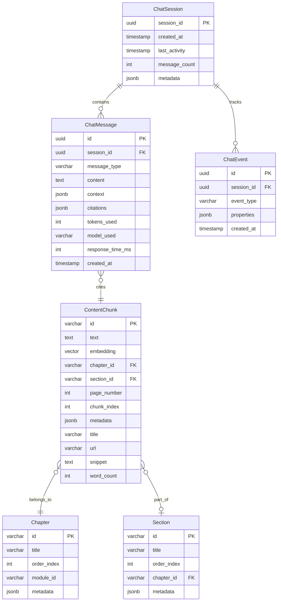

# Data Model: Integrated RAG Chatbot

**Created**: 2025-01-14
**Version**: 1.0.0

## Overview

The RAG chatbot system uses a dual-database architecture:
1. **Qdrant Vector Database**: Stores content embeddings for semantic search
2. **Neon PostgreSQL**: Stores chat sessions, messages, and analytics

## Entity Relationships



## Core Entities

### 1. Content Entities

#### ContentChunk
Represents a chunk of book content that has been embedded for search.

**Properties:**
- `id` (string, PK): Unique identifier for the chunk
- `text` (string): Actual content text (1000-2000 words)
- `embedding` (vector): 1536-dimensional embedding vector
- `chapter_id` (string, FK): Reference to parent chapter
- `section_id` (string, FK, nullable): Reference to parent section
- `page_number` (int, nullable): Page number in the book
- `chunk_index` (int): Order within chapter/section
- `metadata` (jsonb): Additional metadata (headings, etc.)
- `title` (string): Chunk title for citations
- `url` (string): URL to the chunk in the book
- `snippet` (string): Brief excerpt for search results
- `word_count` (int): Number of words in the chunk

**Validation Rules:**
- `text` must be between 100 and 4000 characters
- `embedding` must be a 1536-dimensional vector
- `word_count` must be between 50 and 2000

#### Chapter
Represents a book chapter containing content chunks.

**Properties:**
- `id` (string, PK): Unique identifier
- `title` (string): Chapter title
- `order_index` (int): Order in the book
- `module_id` (string): Parent module identifier
- `metadata` (jsonb): Chapter metadata

#### Section
Represents a section within a chapter.

**Properties:**
- `id` (string, PK): Unique identifier
- `title` (string): Section title
- `order_index` (int): Order within chapter
- `chapter_id` (string, FK): Parent chapter
- `metadata` (jsonb): Section metadata

### 2. Chat Entities

#### ChatSession
Represents an anonymous user chat session.

**Properties:**
- `session_id` (uuid, PK): Anonymous session identifier
- `created_at` (timestamp): Session creation time
- `last_activity` (timestamp): Last message timestamp
- `message_count` (int): Total messages in session
- `metadata` (jsonb): Session metadata (user agent, etc.)

**GDPR Compliance:**
- No personal data stored
- Session ID is random UUID v4
- Automatic deletion after 7 days

#### ChatMessage
Represents an individual chat message.

**Properties:**
- `id` (uuid, PK): Unique message identifier
- `session_id` (uuid, FK): Parent session
- `message_type` (enum): 'user' or 'assistant'
- `content` (string): Message content
- `context` (jsonb): Context at time of message
  - `selectedText`: User-selected text (if any)
  - `currentPage`: Current page URL
  - `retrievedChunks`: IDs of chunks used
- `citations` (jsonb): Array of citation objects
  - `title`: Source title
  - `url`: Source URL
  - `snippet`: Source excerpt
- `tokens_used` (int, nullable): OpenAI tokens consumed
- `model_used` (string, nullable): OpenAI model used
- `response_time_ms` (int, nullable): Response time in milliseconds
- `created_at` (timestamp): Message timestamp

**Validation Rules:**
- `content` must be between 1 and 4000 characters
- `citations` required for assistant messages
- `response_time_ms` required for assistant messages

### 3. Analytics Entities

#### ChatEvent
Represents an analytics event for service improvement.

**Properties:**
- `id` (uuid, PK): Unique event identifier
- `session_id` (uuid, FK): Parent session
- `event_type` (string): Type of event
  - 'query_submitted'
  - 'response_received'
  - 'citation_clicked'
  - 'rate_limited'
  - 'error_occurred'
- `properties` (jsonb): Event-specific properties
- `created_at` (timestamp): Event timestamp

**GDPR Compliance:**
- All data anonymized
- No user identifiers
- Aggregated for analytics

## Database Schema

### PostgreSQL Schema

```sql
-- Chapters table
CREATE TABLE chapters (
    id VARCHAR(255) PRIMARY KEY,
    title VARCHAR(500) NOT NULL,
    order_index INTEGER NOT NULL,
    module_id VARCHAR(255) NOT NULL,
    metadata JSONB DEFAULT '{}'::jsonb,
    created_at TIMESTAMP WITH TIME ZONE DEFAULT NOW(),
    updated_at TIMESTAMP WITH TIME ZONE DEFAULT NOW()
);

-- Sections table
CREATE TABLE sections (
    id VARCHAR(255) PRIMARY KEY,
    title VARCHAR(500) NOT NULL,
    order_index INTEGER NOT NULL,
    chapter_id VARCHAR(255) NOT NULL REFERENCES chapters(id),
    metadata JSONB DEFAULT '{}'::jsonb,
    created_at TIMESTAMP WITH TIME ZONE DEFAULT NOW(),
    updated_at TIMESTAMP WITH TIME ZONE DEFAULT NOW()
);

-- Chat sessions table
CREATE TABLE chat_sessions (
    session_id UUID PRIMARY KEY DEFAULT gen_random_uuid(),
    created_at TIMESTAMP WITH TIME ZONE DEFAULT NOW(),
    last_activity TIMESTAMP WITH TIME ZONE DEFAULT NOW(),
    message_count INTEGER DEFAULT 0,
    metadata JSONB DEFAULT '{}'::jsonb
);

-- Chat messages table
CREATE TABLE chat_messages (
    id UUID PRIMARY KEY DEFAULT gen_random_uuid(),
    session_id UUID NOT NULL REFERENCES chat_sessions(session_id),
    message_type VARCHAR(20) NOT NULL CHECK (message_type IN ('user', 'assistant')),
    content TEXT NOT NULL,
    context JSONB DEFAULT '{}'::jsonb,
    citations JSONB DEFAULT '[]'::jsonb,
    tokens_used INTEGER,
    model_used VARCHAR(50),
    response_time_ms INTEGER,
    created_at TIMESTAMP WITH TIME ZONE DEFAULT NOW()
);

-- Analytics events table
CREATE TABLE chat_events (
    id UUID PRIMARY KEY DEFAULT gen_random_uuid(),
    session_id UUID,
    event_type VARCHAR(50) NOT NULL,
    properties JSONB DEFAULT '{}'::jsonb,
    created_at TIMESTAMP WITH TIME ZONE DEFAULT NOW()
);

-- Indexes for performance
CREATE INDEX idx_chapters_module_id ON chapters(module_id);
CREATE INDEX idx_sections_chapter_id ON sections(chapter_id);
CREATE INDEX idx_chat_sessions_last_activity ON chat_sessions(last_activity);
CREATE INDEX idx_chat_messages_session_id ON chat_messages(session_id);
CREATE INDEX idx_chat_messages_created_at ON chat_messages(created_at);
CREATE INDEX idx_chat_events_session_id ON chat_events(session_id);
CREATE INDEX idx_chat_events_created_at ON chat_events(created_at);
CREATE INDEX idx_chat_events_type ON chat_events(event_type);
```

### Qdrant Collection Schema

```python
# Collection configuration
collection_config = {
    "vectors": {
        "size": 1536,  # OpenAI embedding dimension
        "distance": "Cosine"
    },
    "payload_schema": {
        "text": "text",
        "chapter_id": "keyword",
        "section_id": "keyword",
        "page_number": "integer",
        "chunk_index": "integer",
        "title": "text",
        "url": "keyword",
        "snippet": "text",
        "word_count": "integer",
        "metadata": "json"
    }
}
```

## State Transitions

### Chat Session Lifecycle

1. **Created** → **Active**: User sends first message
2. **Active** → **Idle**: No activity for 30 minutes
3. **Active** → **Expired**: 7 days since creation
4. **Idle** → **Active**: User sends new message
5. **Any State** → **Deleted**: Manual clear or automatic cleanup

### Message Processing Flow

1. **Received**: User query submitted
2. **Validated**: Input validation passed
3. **Searching**: Retrieving relevant content
4. **Generating**: Creating response with LLM
5. **Responded**: Response returned to user
6. **Stored**: Message saved to database

## Data Retention Policy

### GDPR Compliance

1. **Chat Sessions**: Automatically deleted after 7 days
2. **Chat Messages**: Deleted with parent session
3. **Analytics Events**: Aggregated and deleted after 30 days
4. **IP Addresses**: Never stored
5. **User Identifiers**: Never collected

### Cleanup Process

```python
# Daily cleanup job
async def cleanup_expired_data():
    """Delete data older than retention period"""

    # Delete sessions older than 7 days
    cutoff_date = datetime.utcnow() - timedelta(days=7)

    await db.execute("""
        DELETE FROM chat_sessions
        WHERE last_activity < $1
    """, cutoff_date)

    # Aggregate and delete old analytics
    analytics_cutoff = datetime.utcnow() - timedelta(days=30)

    # Aggregate before deletion
    await aggregate_analytics(analytics_cutoff)

    # Delete old events
    await db.execute("""
        DELETE FROM chat_events
        WHERE created_at < $1
    """, analytics_cutoff)
```

## Query Patterns

### Common Queries

1. **Session Messages**
   ```sql
   SELECT * FROM chat_messages
   WHERE session_id = $1
   ORDER BY created_at ASC
   LIMIT 20;
   ```

2. **Recent Sessions**
   ```sql
   SELECT * FROM chat_sessions
   WHERE last_activity > NOW() - INTERVAL '1 hour'
   ORDER BY last_activity DESC;
   ```

3. **Analytics Summary**
   ```sql
   SELECT
       event_type,
       COUNT(*) as count,
       DATE_TRUNC('hour', created_at) as hour
   FROM chat_events
   WHERE created_at > NOW() - INTERVAL '24 hours'
   GROUP BY event_type, hour
   ORDER BY hour DESC;
   ```

4. **Content Search Preparation**
   ```python
   # Search in Qdrant
   results = qdrant_client.search(
       collection_name="book_content",
       query_vector=query_embedding,
       limit=5,
       score_threshold=0.7,
       with_payload=True
   )
   ```

## Optimization Strategies

### Database Optimization

1. **Connection Pooling**: 5-20 connections for serverless
2. **Read Replicas**: For analytics queries
3. **Partitioning**: By date for analytics tables
4. **Indexing**: Composite indexes for common queries

### Vector Search Optimization

1. **Quantization**: INT8 scalar quantization
2. **Indexing**: HNSW with m=16, ef=128
3. **Caching**: Redis for frequent queries
4. **Batching**: Process embeddings in batches of 100

### Cost Optimization

1. **Token Management**: Intelligent context windowing
2. **Model Routing**: GPT-3.5 for 95% of queries
3. **Caching**: 24-hour cache for identical queries
4. **Monitoring**: Real-time cost tracking

## Security Considerations

### Data Protection

1. **Encryption**: All data encrypted at rest
2. **Transmission**: TLS 1.3 for all API calls
3. **API Keys**: Stored in environment variables
4. **Injection Protection**: Parameterized queries

### Access Control

1. **Rate Limiting**: 10 requests/minute per IP
2. **Input Validation**: Strict schema validation
3. **Error Handling**: No sensitive data in errors
4. **Monitoring**: Suspicious activity detection